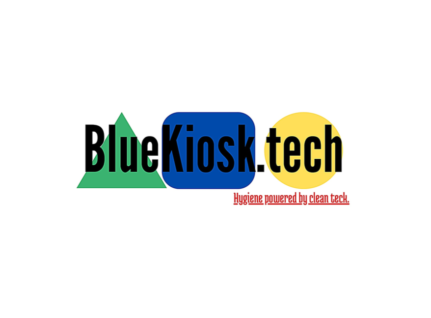

<p align="center">
  
</p>

<h1 align="center">BlueKiosk.tech</h1>

<p align="center">
<b>Hygiene Powered by Clean Tech</b><br>
Building the next generation of self-service bottle sanitization.
</p>

<p align="center">


</p>

---

# About

BlueKiosk.tech is developing an innovative **self-service bottle sanitization kiosk** designed to make reusable bottle hygiene simple, fast and accessible.

Our first solution targets **fitness centers**, where reusable bottles are used every day but are often cleaned irregularly.

By combining clean technology with an intuitive user experience, BlueKiosk aims to make bottle sanitization as natural as refilling a bottle.

---

# Why BlueKiosk?

Reusable bottles are becoming part of everyday life.

However, many users unknowingly expose themselves to bacteria, mold and other microorganisms due to inadequate cleaning habits.

BlueKiosk was created to solve this invisible hygiene challenge by providing an easy-to-use public sanitization solution that encourages healthier and more sustainable habits.

---

# Our Solution

BlueKiosk is developing a smart self-service kiosk capable of sanitizing reusable bottles and their caps in just a few simple steps.

```
Insert Bottle
      │
      ▼
 Bottle Detection
      │
      ▼
 Sanitization Cycle
      │
      ▼
 Drying Process
      │
      ▼
 Ready to Use
```

Designed to be intuitive, fast and environmentally responsible, the system aims to integrate naturally into high-traffic public environments.

---

# Key Features

- 🦠 Bottle & cap sanitization

- ⚡ Fast sanitization cycle

- ♻️ Eco-friendly solution

- 🏋️ Designed for fitness centers

- 💳 Self-service experience

- 📱 Future-ready connected platform

---

# Current Status

| Milestone | Status |
|------------|:------:|
| Product Vision | ✅ |
| Market Research | ✅ |
| Customer Validation | ✅ |
| Website MVP | ✅ |
| Product Design | ✅ |
| Functional Prototype | 🚧 |
| Pilot Program | ⏳ |
| Commercial Deployment | ⏳ |

---

# Roadmap

- Complete the functional prototype

- Validate the user experience

- Pilot installations in fitness centers

- Collect operational feedback

- Prepare commercial deployment

---

# Repository Structure

```
BlueKiosk.tech/

├── website/
├── CSS/
├── JavaScript/
├── images/
├── docs/
└── README.md
```

---

# Technology Stack

### Front-End

- HTML5

- CSS3

- JavaScript

### Services

- EmailJS

- Google Workspace

### Design

- Responsive Design

- Bilingual Experience (FR / EN)

---

# Vision

BlueKiosk is more than a product.

It represents a new approach to public hygiene by combining sustainability, innovation and user experience into one simple and accessible solution.

Our ambition is to become the reference for self-service bottle sanitization in gyms, workplaces, campuses and other public spaces.

---

# Project Website

🌐 https://bluekiosk.tech

---

# Follow the Project

- Website

- GitHub

- Instagram

- Facebook

- Blog

---

# License

This repository is part of the BlueKiosk.tech project.

© BlueKiosk.tech — All Rights Reserved.
